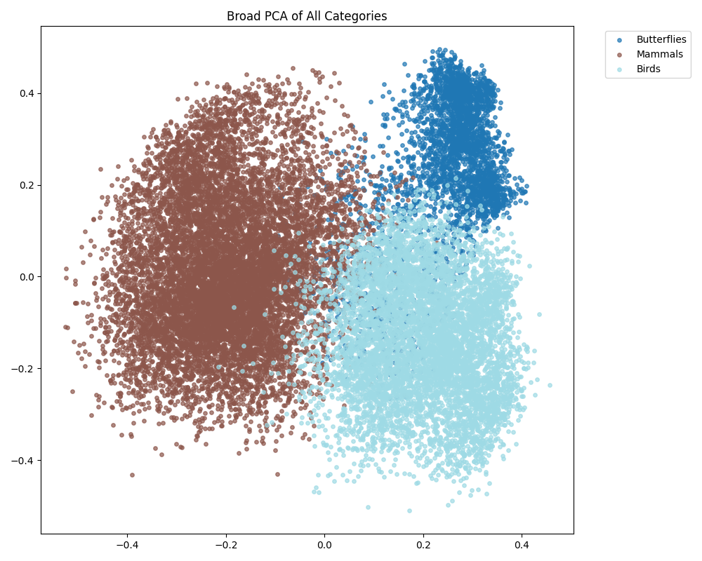
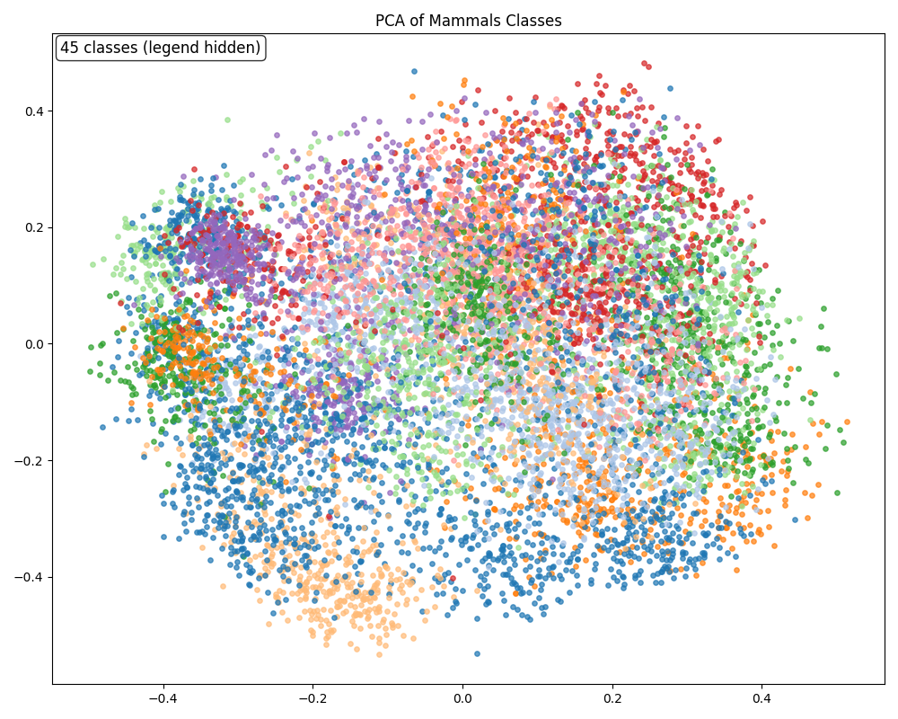
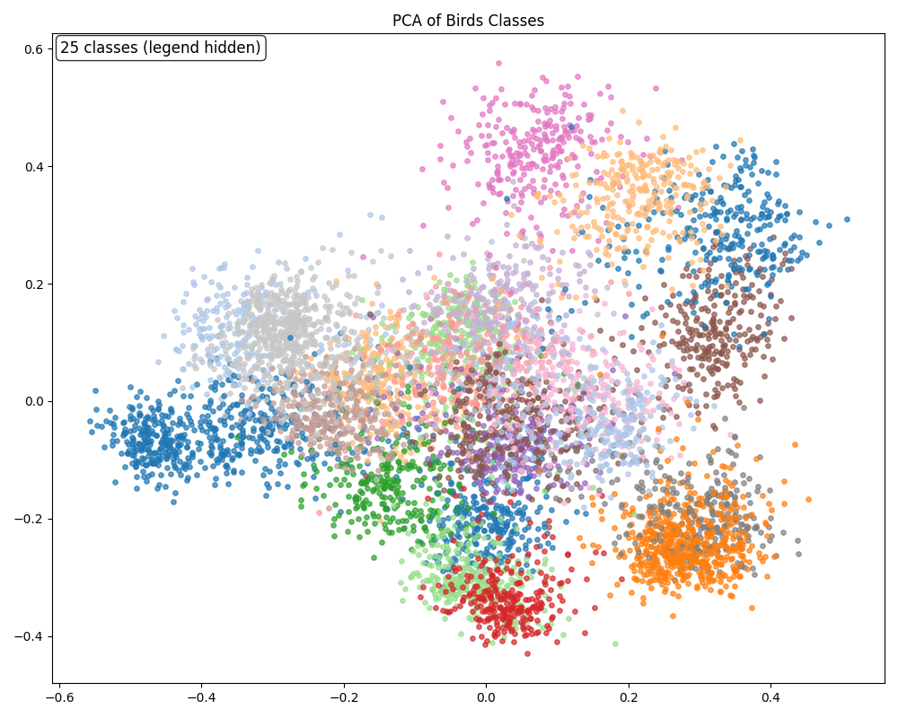
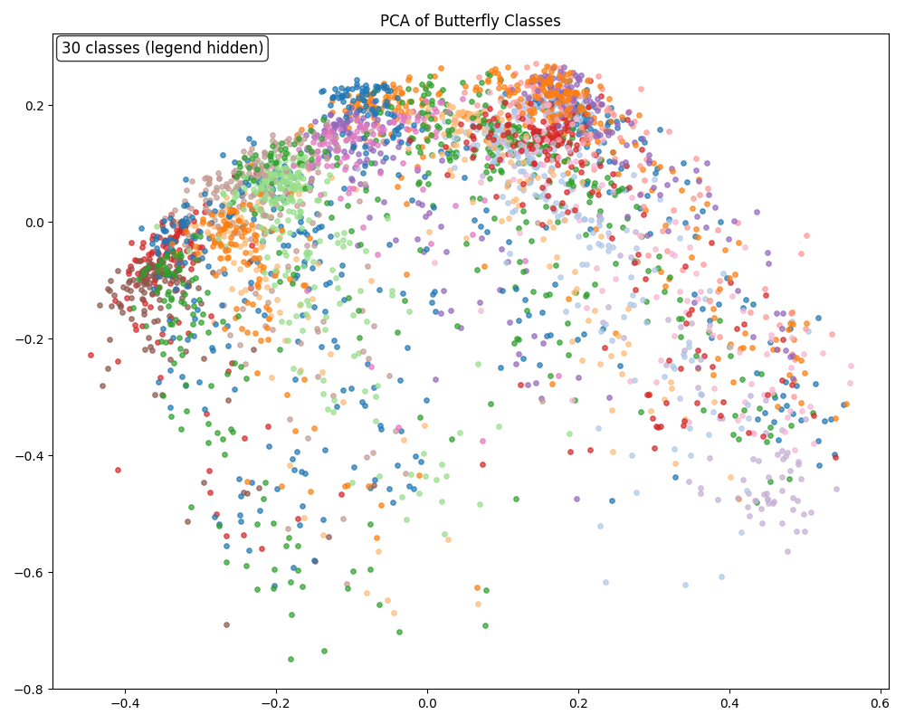
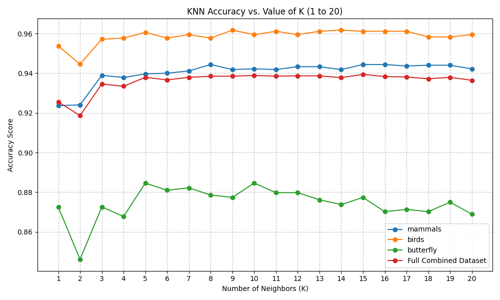
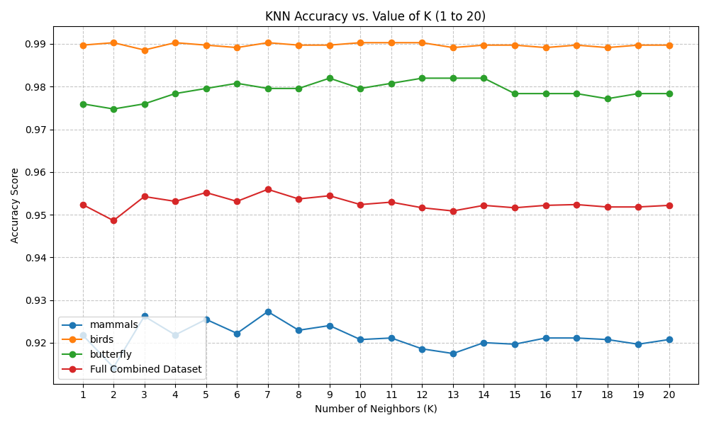

# 100-Species Animal Classifier: Fine-Tuned CNN for Indian Wildlife & Beyond

**Course:** Statistical Methods in AI (SMAI) — Assignment 3, Tier 2  
**Theme:** T7.7 — 100-Species Fine-Tuned Identifier  
**Dataset:** [ViratGarg/animal_species_SMAI](https://huggingface.co/datasets/ViratGarg/animal_species_SMAI)
**Team Name** : Kuch bhi daal do
**Team Members** : Krrish Goenka (2023112023) , Krish Agarwal (2023113017), Pranav Shankar (2023112011) , Virat Garg (2023101081), Manas Agrawal (2023113023)

---

## Abstract

We present a multi-approach animal species classification system that unifies three wildlife datasets — mammals, birds, and butterflies — into a single 100-class benchmark. Three distinct classification strategies are evaluated: (1) a single ResNet50 fine-tuned end-to-end on all 100 classes, (2) a two-stage hierarchical ResNet50 pipeline that first routes images to their animal group before identifying the species, and (3) a training-free CLIP-based approach using KNN and SVM classifiers over frozen visual embeddings. All approaches achieve test accuracy above 94% on the combined dataset, with the fine-tuned ResNet pipelines reaching up to **97.22%** accuracy. Results are consistent with expectations — the task, while requiring 100-way discrimination, is relatively straightforward for modern pretrained backbones that were originally trained on far more complex and diverse visual distributions.

---

## 1. Introduction

The goal of this project is to build a species-level classifier that can distinguish between 100 animal species spanning mammals, birds, and butterflies from a single image. This aligns with the T7 theme of building a wildlife identifier capable of top-3 species predictions, while extending it to the more challenging T7.7 variant involving fine-tuning on a combined 100-class corpus.

We explore three progressively different paradigms:

- **Direct fine-tuning:** A single ResNet50 trained jointly on all species.
- **Hierarchical fine-tuning:** A two-stage pipeline that first classifies the animal *group*, then classifies the *species* within that group using a dedicated per-group model.
- **Zero-shot and embedding-based classification:** CLIP and BioCLIP visual embeddings paired with classical KNN and SVM classifiers, requiring no gradient-based training on the target dataset.

---

## 2. Dataset

The dataset is a custom compilation combining three publicly available animal image datasets provided in the assignment. It is hosted on HuggingFace:

> 📦 **[ViratGarg/animal_species_SMAI](https://huggingface.co/datasets/ViratGarg/animal_species_SMAI)**

| Subset     | Species | Images |
|------------|---------|--------|
| Mammals    | 45      | 13,751 |
| Birds      | 25      | 8,750  |
| Butterflies| 30      | 4,158  |
| **Total**  | **100** | **26,659** |

**Splits:**

| Split | Images |
|-------|--------|
| Train | 21,327 |
| Val   | 2,666  |
| Test  | 2,666  |

The three subsets were merged into a unified label space of 100 classes. Class balance is reasonable across subsets, with per-species support in the test set ranging from ~11 to ~36 samples.

---

## 3. Methods

### 3.1 Model 1: Single ResNet50 (Direct 100-Class Fine-Tuning)

**Architecture:** A standard `ResNet50` pretrained on ImageNet1K is used as the backbone. The final fully-connected layer is replaced with a linear head mapping to 100 output classes. The entire network is fine-tuned end-to-end.

**Training Details:**
- **Loss:** Cross-entropy with label smoothing (ε = 0.1) to reduce overconfidence
- **Optimizer:** AdamW
- **LR Schedule:** Cosine annealing over 20 epochs, starting at 1e-4
- **Regularization:** Label smoothing, weight decay
- **Input:** Standard ImageNet normalization (224×224)

**Design Rationale:** Fine-tuning a ResNet50 directly on all 100 classes is the simplest unified approach. It requires no prior knowledge about category structure and allows the network to learn any cross-category visual features it deems useful.

---

### 3.2 Model 2: Two-Stage Hierarchical ResNet50 Pipeline

**Architecture:** This approach uses **4 fine-tuned ResNet50 models** in a cascaded pipeline:

```
Input Image
    │
    ▼
┌─────────────────────────────────────────┐
│  Stage 1: Group Classifier (ResNet50)   │
│  3-way classification:                  │
│  Bird | Butterfly | Mammal              │
└─────────────────────────────────────────┘
    │           │            │
    ▼           ▼            ▼
 Birds       Butterfly    Mammals
 ResNet50    ResNet50     ResNet50
 (25-class)  (30-class)   (45-class)
```

**Stage 1 — Group Classifier:**  
A ResNet50 fine-tuned to classify images into one of three animal groups (birds / butterflies / mammals). At test time, the predicted group label routes the image to the corresponding Stage 2 model.

**Stage 2 — Species Classifiers:**  
Three separate ResNet50 models, each fine-tuned on only its group's species. This reduces the per-model classification problem from 100-way to at most 45-way, leading to a simpler decision boundary per model.

**Training Details (per model):**
- 15 epochs with cosine annealing LR schedule (initial lr = 1e-4)
- Checkpointing on best validation accuracy
- Same label smoothing and normalization as Model 1

**Design Rationale:** Hierarchical decomposition mirrors the biological taxonomy. It reduces the complexity of each sub-problem and isolates confusion to within-group species, preventing cross-group errors entirely (assuming correct routing).

---

### 3.3 Model 3: CLIP Embeddings + KNN / SVM

**Architecture:** This approach requires **no fine-tuning** on the target dataset. Instead, frozen image encoders are used to extract dense visual embeddings, which are then classified using traditional machine learning methods.

Two CLIP variants are evaluated:

| Model | Description |
|-------|-------------|
| **OpenAI CLIP ViT-B/16** | General-purpose vision-language model trained on 400M image-text pairs |
| **BioCLIP** | Domain-specialized CLIP variant trained on biological/taxonomic image-text data |
| **OpenAI CLIP ViT-B/32** | Lighter variant of the general CLIP model |

**Classification Heads:**

- **Zero-Shot:** Cosine similarity between the image embedding and 100 text prompt embeddings (e.g., *"a photo of a [species name]"*). No training data required.
- **KNN (K=1 to 20):** Nearest-neighbor lookup in the embedding space over the full training split.
- **SVM:** Linear SVM trained on the extracted embeddings of the training split.

**Design Rationale:** CLIP embeddings are rich, semantically meaningful representations. Pairing them with KNN and SVM — classical algorithms covered in the course — is a creative bridge between traditional machine learning and modern deep learning, demonstrating that powerful representations unlock strong performance even with simple classifiers.

---

## 4. Feature Space Analysis (PCA Visualizations)

Before evaluating classification performance, we analyze the structure of CLIP embeddings by projecting them onto their first two principal components.

### 4.1 Broad Category Separation



The broad PCA across all three animal groups reveals **clear macro-level separation**: butterflies form a compact, well-separated cluster in the upper-right quadrant, while mammals and birds, though overlapping at the boundary, occupy mostly distinct regions. This confirms that CLIP embeddings inherently encode high-level biological categories without any task-specific training, and justifies the use of a hierarchical approach in Model 2.

**Silhouette Score (3 categories): 0.1449**

### 4.2 Within-Group Species Clustering

| Dataset | Silhouette Score |
|---------|-----------------|
| Mammals (45 species) | 0.1165 |
| Birds (25 species) | 0.1192 |
| Butterflies (30 species) | 0.0600 |

#### Mammals (45 Classes)


The mammal embedding space shows a diffuse, spread-out distribution with moderate inter-class overlap. This is consistent with the broader morphological diversity of 45 mammal species (from arctic foxes to blue whales), which occupy varied visual domains.

#### Birds (25 Classes)


Bird embeddings show a noticeably more structured distribution, with several visually distinct clusters emerging in the 2D projection. This correlates with the higher KNN and SVM accuracy observed for birds relative to other groups.

#### Butterflies (30 Classes)


Butterfly embeddings are the most overlapping in 2D PCA space (lowest silhouette score: 0.0600), which explains the comparatively lower KNN accuracy (~88%) for this subset. While butterflies are visually distinctive to the human eye, their within-class color and pattern variation can make embedding-space separation challenging for general CLIP models not specialized in entomology.

---

## 5. Results

### 5.1 Model 1: Single ResNet50 — Training Curve

| Epoch | Train Acc | Val Acc | Test Acc |
|-------|-----------|---------|----------|
| 1     | 78.09%    | 94.37%  | 94.11%   |
| 5     | 98.18%    | 96.06%  | 95.87%   |
| 10    | 99.34%    | 96.70%  | 96.51%   |
| 15    | 99.84%    | 97.00%  | 97.11%   |
| 20    | 99.96%    | 97.41%  | **97.22%** |

**Final Test Accuracy: 97.22% | Macro Specificity: 99.97%**

The model converges rapidly — by epoch 1, validation accuracy already exceeds 94%. The training accuracy approaches 100% by epoch 15, while validation accuracy plateaus around 97%, indicating a small but manageable generalization gap. The cosine annealing schedule visibly helps the model settle into a sharper minimum in later epochs.

---

### 5.2 Model 2: Two-Stage Hierarchical Pipeline — Results

**Stage 1 (Group Classification):**

| Metric | Score |
|--------|-------|
| Accuracy | **99.89%** |
| Macro F1 | 99.86% |
| Macro Specificity | 99.93% |

| Class | Precision | Recall | F1 |
|-------|-----------|--------|----|
| Birds | 1.000 | 0.999 | 0.999 |
| Butterfly | 0.998 | 0.998 | 0.998 |
| Mammals | 0.999 | 0.999 | 0.999 |

The group classifier achieves near-perfect accuracy. Only **3 samples out of 2,666** were misrouted (0.1%), and misrouted samples cannot recover the correct species regardless of Stage 2 performance.

**Stage 2 (Species Classification):**

| Group | Test Accuracy | Macro F1 |
|-------|---------------|----------|
| Birds (25 classes) | 97.14% | 97.13% |
| Butterflies (30 classes) | 97.59% | 97.54% |
| Mammals (45 classes) | 96.66% | 96.59% |

**End-to-End Pipeline:**

| Metric | Score |
|--------|-------|
| Routing Accuracy | 99.89% |
| End-to-end Species Accuracy | **96.89%** |
| End-to-end Macro F1 | 96.91% |
| End-to-end Macro Specificity | 99.97% |

---

### 5.3 Model 3: CLIP Embeddings

#### KNN (CLIP ViT-B/16 Embeddings)



| Dataset | Best KNN Acc (k≈5–9) |
|---------|----------------------|
| Birds | ~96% |
| Butterflies | ~88% |
| Mammals | ~94% |
| Full Combined | ~94% |

KNN accuracy stabilizes quickly after k=3, with birds achieving the highest accuracy (~96%) and butterflies the lowest (~88%). The dip at k=2 (tied votes) across all curves is a known artifact of even-k KNN.

#### KNN (Standard CLIP Embeddings — Image 3)



| Dataset | Best KNN Acc |
|---------|--------------|
| Birds | ~99% |
| Butterflies | ~98% |
| Mammals | ~92–93% |
| Full Combined | ~95% |

#### SVM (CLIP ViT-B/16 Embeddings)

| Dataset | Accuracy |
|---------|----------|
| Mammals | 95.86% |
| Birds | 97.54% |
| Butterflies | 91.71% |
| **Full Combined** | **95.76%** |

#### SVM (BioCLIP Embeddings)

| Dataset | Accuracy |
|---------|----------|
| Mammals | 94.62% |
| Birds | **99.03%** |
| Butterflies | **98.08%** |
| **Full Combined** | **96.61%** |

BioCLIP shows dramatically improved butterfly accuracy (91.71% → 98.08%), which is expected: BioCLIP is trained on biological taxonomy image data and likely has richer representations for fine-grained species that share visual traits.

#### Zero-Shot Classification (No Training, Text Prompts Only)

| Model | Mammals | Birds | Butterflies | Combined |
|-------|---------|-------|-------------|----------|
| CLIP ViT-B/32 | 92.26% | 79.09% | 37.86% | 78.72% |
| CLIP ViT-B/16 | 93.82% | 83.49% | 39.42% | 81.14% |
| BioCLIP | 81.46% | 89.71% | 55.17% | 80.01% |

Zero-shot performance is strong for mammals but significantly weaker for butterflies. Standard CLIP was likely never trained on fine-grained entomological text descriptions, while BioCLIP improves butterfly accuracy substantially (37.86% → 55.17%) at the cost of some mammal performance. The large gap between zero-shot and embedding+classifier approaches confirms that the CLIP visual representations are strong, and the bottleneck in zero-shot mode is the text prompt matching, not the image encoder.

---

### 5.4 Summary Comparison

| Approach | Full Dataset Test Accuracy |
|----------|--------------------------|
| Model 1: Single ResNet50 (Direct) | **97.22%** |
| Model 2: Two-Stage Hierarchical ResNet50 | 96.89% |
| Model 3: CLIP + SVM (ViT-B/16) | 95.76% |
| Model 3: BioCLIP + SVM | 96.61% |
| Model 3: CLIP + KNN (best k) | ~94% |
| Zero-Shot CLIP ViT-B/16 | 81.14% |
| Zero-Shot BioCLIP | 80.01% |

---

## 6. Discussion

### 6.1 Why Are Accuracies So High?

The uniformly high performance across all three approaches is not surprising and can be attributed to several factors:

**Pretrained models are overqualified for this task.** ResNet50 pretrained on ImageNet1K has seen 1.2 million images across 1,000 diverse categories including many animal classes. Similarly, CLIP was trained on 400 million image-text pairs from the internet. Fine-tuning such a model on 100 animal species with ~200 training images per species is, relatively speaking, a low-complexity downstream task. The model already possesses deep feature extractors for fur texture, wing patterns, body shape, and colour — our training merely aligns the final classification head to the new label space.

**The species are visually distinctive.** Most species in our dataset are easily distinguishable even to the human eye — a giraffe looks nothing like a warthog; a kingfisher is visually far from a crane. This is distinct from fine-grained benchmarks like CUB-200 (200 bird subspecies) where inter-class differences can be subtle.

**High-quality curated datasets.** The three source datasets used in this project are clean, well-labelled, and contain consistently framed images, which reduces noise in training.

### 6.2 Why Is CLIP Lower Than the Fine-Tuned Models?

Despite CLIP embeddings being powerful, the embedding+classifier approach scores slightly below the fine-tuned ResNet pipelines. Several factors explain this:

**KNN and SVM are inherently limited.** KNN makes no generalization — it votes based on raw proximity in a 512-dimensional space. SVM finds a linear decision boundary in that space. While CLIP's representation space is semantically rich, it was not explicitly trained to be linearly separable at the species level. Fine-tuned ResNet, by contrast, adapts its entire representation to maximize species-level separability.

**No task-specific adaptation.** Fine-tuned models adapt their feature extractors to the specific visual vocabulary of our 100 species. CLIP embeddings remain general-purpose, which is powerful for zero-shot transfer but suboptimal when labeled data is available.

**Note on Methodology:** The choice to use KNN and SVM over CLIP embeddings was deliberate and pedagogically motivated — these are classical algorithms studied in the course curriculum. Integrating them with state-of-the-art CLIP embeddings is a creative application that demonstrates how traditional ML methods can still extract significant value from modern deep representations.

### 6.3 Suggestions for Improving the CLIP-Based Approach

If fine-tuned classifiers are not an option and we must work within the embedding paradigm, stronger alternatives to KNN/SVM include:

**Linear Probe with MLP:** Replace the linear SVM with a shallow multi-layer perceptron (2–3 layers) trained on the CLIP embeddings. This breaks the linear separability assumption and typically gains 1–3% over SVM.

**Gaussian Naive Bayes / Logistic Regression:** These are also course-relevant and often competitive with SVM on high-dimensional embeddings.

**Prototype Networks (Few-Shot Learning):** Compute a centroid embedding per class from training samples, then classify test images by nearest centroid. This is elegant, interpretable, and well-suited to CLIP's embedding geometry.

**CLIP Fine-Tuning (CLIP-Adapter / LoRA):** A lightweight adapter layer trained on top of CLIP embeddings while keeping the backbone frozen. This combines the benefits of CLIP's general representations with task-specific adaptation at minimal computational cost.

**Cross-Modal Retrieval Augmented Classification:** For each test image, retrieve the top-k most similar training images using CLIP, then take a weighted vote. This is a form of learned KNN that benefits from semantic consistency.

---

## 7. Limitations

**Butterfly embeddings cluster poorly.** The low silhouette score (0.06) for butterfly CLIP embeddings and the comparatively lower test accuracy for butterflies across all methods suggest that butterfly species are the hardest to distinguish. This may reflect limitations in CLIP's exposure to fine-grained entomological data — a domain where BioCLIP demonstrates clear advantages.

**Seal and Blue Whale edge cases.** Among mammals, `seal` (F1: 0.828) and `blue_whale` (F1: 0.840) show the lowest per-class F1 scores. Seals may be confused with sea lions (which are also in the dataset), and blue whale images likely suffer from fewer distinctive close-up visual features compared to terrestrial mammals.

**Test set size.** With only ~26 test samples per species on average, per-class metrics have high variance. A larger held-out test set would provide more reliable per-species estimates.

**No data augmentation ablation.** We do not report an ablation over augmentation strategies (random crops, color jitter, mixup, etc.), which could provide additional insight into the robustness of the fine-tuned models.

**App deployment.** A live HuggingFace Spaces demo is pending/in progress. The system is functional locally.

---

## 8. Conclusion

We have demonstrated three effective approaches to 100-class animal species classification, all achieving >95% accuracy on a combined mammals/birds/butterflies benchmark. The single ResNet50 direct fine-tune achieves the highest overall accuracy (97.22%), while the hierarchical two-stage pipeline (96.89%) offers better interpretability and modular extensibility. The CLIP+SVM approach (up to 96.61% with BioCLIP) is notable for requiring no gradient-based training on the target dataset, demonstrating the power of modern visual foundation models even with classical classifiers. Across all methods, high accuracy is primarily attributable to the strong pretrained representations and the relative visual distinctiveness of the chosen species — the pretrained models were built for far harder tasks.

---

## References

1. He, K., Zhang, X., Ren, S., & Sun, J. (2016). Deep Residual Learning for Image Recognition. *CVPR*.
2. Radford, A., et al. (2021). Learning Transferable Visual Models From Natural Language Supervision (CLIP). *ICML*.
3. Stevens, S., et al. (2024). BioCLIP: A Vision Foundation Model for the Tree of Life. *CVPR*.
4. Cover, T. M., & Hart, P. E. (1967). Nearest Neighbor Pattern Classification. *IEEE Transactions on Information Theory*.
5. Cortes, C., & Vapnik, V. (1995). Support-Vector Networks. *Machine Learning*.
6. Dataset: [ViratGarg/animal_species_SMAI](https://huggingface.co/datasets/ViratGarg/animal_species_SMAI) on HuggingFace.

---

*SMAI Assignment 3 — Tier 2 | T7.7: 100-Species Fine-Tuned Identifier*